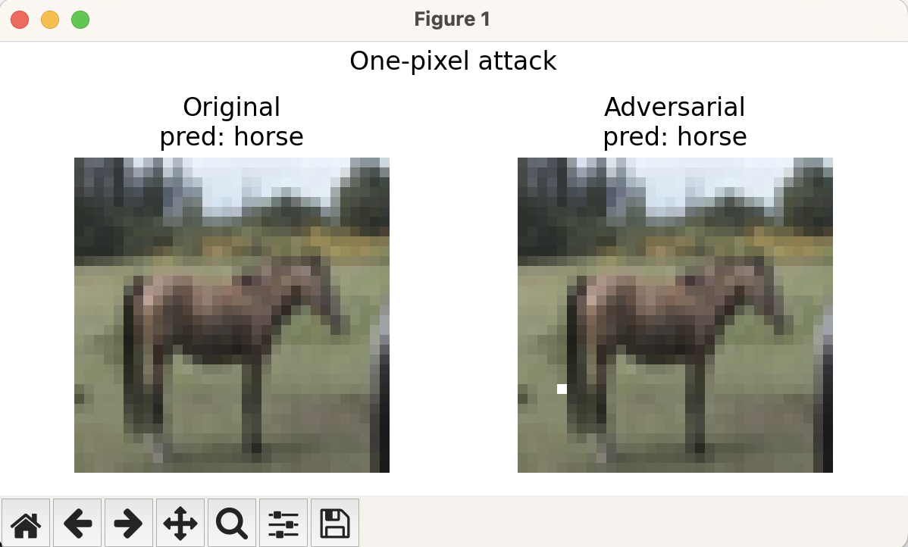

---

## Running Certain Examples

Running `python demo.py --index 9999 --pixels 1 --popsize 400 --max_iter 100` did not prevent classifier from correctly classifying the horse.

The attack isn’t “broken” – some CIFAR-10 pictures (especially
well-framed horses & trucks) are simply much harder to flip with only one
pixel.



Changing 3 pixels (with added iters and pop size) wasnt enough either (5 restarts were implemented as well)

```
python demo.py --index 9999 --pixels 3 --popsize 500 --max_iter 200 --restarts 5
```
