# One-/Few-Pixel Attack – Batch Results

*Generated: 2025-05-03 17:04:03*

| idx | orig → pred | variant (pixels) | cmd | result | image |
|----:|-------------|------------------|-----|--------|-------|
| 0 | dog | 1 | `python demo.py --index 0 --pixels 1 --popsize 400 --max\_iter 500` | ✅ **success** |  →  |
| 1 | ship | 1 | `python demo.py --index 1 --pixels 1 --popsize 400 --max\_iter 500` | ✅ **success** |  →  |
| 2 | airplane | 1 | `python demo.py --index 2 --pixels 1 --popsize 400 --max\_iter 500` | ✅ **success** |  →  |
| 3 | ship | 1 | `python demo.py --index 3 --pixels 1 --popsize 400 --max\_iter 500` | ✅ **success** | 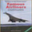 →  |
| 4 | frog | 1 | `python demo.py --index 4 --pixels 1 --popsize 400 --max\_iter 500` | ✅ **success** | 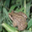 → 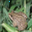 |
| 5 | frog | — | `python demo.py --index 5 --pixels 20 --popsize 400 --max\_iter 500` | ❌ fail | 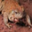 →  |
| 6 | automobile | 1 | `python demo.py --index 6 --pixels 1 --popsize 400 --max\_iter 500` | ✅ **success** |  →  |
| 7 | frog | 1 | `python demo.py --index 7 --pixels 1 --popsize 400 --max\_iter 500` | ✅ **success** |  →  |
| 8 | cat | 3 | `python demo.py --index 8 --pixels 3 --popsize 400 --max\_iter 500` | ✅ **success** | 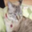 → 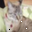 |
| 9 | automobile | 3 | `python demo.py --index 9 --pixels 3 --popsize 400 --max\_iter 500` | ✅ **success** | 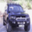 →  |
| 10 | airplane | 7 | `python demo.py --index 10 --pixels 7 --popsize 400 --max\_iter 500` | ✅ **success** | 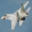 → 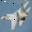 |
| 11 | truck | — | `python demo.py --index 11 --pixels 20 --popsize 400 --max\_iter 500` | ❌ fail |  →  |
| 12 | dog | 3 | `python demo.py --index 12 --pixels 3 --popsize 400 --max\_iter 500` | ✅ **success** | 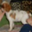 →  |
| 13 | horse | — | `python demo.py --index 13 --pixels 20 --popsize 400 --max\_iter 500` | ❌ fail | 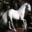 →  |
| 14 | truck | 3 | `python demo.py --index 14 --pixels 3 --popsize 400 --max\_iter 500` | ✅ **success** | 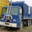 →  |
| 15 | ship | 3 | `python demo.py --index 15 --pixels 3 --popsize 400 --max\_iter 500` | ✅ **success** |  →  |
| 16 | dog | 3 | `python demo.py --index 16 --pixels 3 --popsize 400 --max\_iter 500` | ✅ **success** |  →  |
| 17 | horse | 1 | `python demo.py --index 17 --pixels 1 --popsize 400 --max\_iter 500` | ✅ **success** | 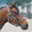 →  |
| 18 | ship | 3 | `python demo.py --index 18 --pixels 3 --popsize 400 --max\_iter 500` | ✅ **success** |  →  |
| 19 | frog | 3 | `python demo.py --index 19 --pixels 3 --popsize 400 --max\_iter 500` | ✅ **success** | 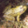 →  |
| 20 | horse | 3 | `python demo.py --index 20 --pixels 3 --popsize 400 --max\_iter 500` | ✅ **success** | 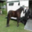 → 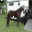 |
| 21 | airplane | 1 | `python demo.py --index 21 --pixels 1 --popsize 400 --max\_iter 500` | ✅ **success** |  →  |
| 22 | deer | 1 | `python demo.py --index 22 --pixels 1 --popsize 400 --max\_iter 500` | ✅ **success** | 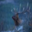 → 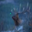 |
| 23 | truck | — | `python demo.py --index 23 --pixels 20 --popsize 400 --max\_iter 500` | ❌ fail |  →  |
| 24 | dog | 1 | `python demo.py --index 24 --pixels 1 --popsize 400 --max\_iter 500` | ✅ **success** | 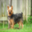 →  |
| 25 | dog | 1 | `python demo.py --index 25 --pixels 1 --popsize 400 --max\_iter 500` | ✅ **success** | 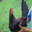 → 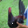 |
| 26 | deer | 1 | `python demo.py --index 26 --pixels 1 --popsize 400 --max\_iter 500` | ✅ **success** | 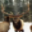 → 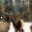 |
| 27 | airplane | 3 | `python demo.py --index 27 --pixels 3 --popsize 400 --max\_iter 500` | ✅ **success** | 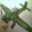 →  |
| 28 | truck | 1 | `python demo.py --index 28 --pixels 1 --popsize 400 --max\_iter 500` | ✅ **success** | 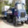 → 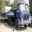 |
| 29 | frog | — | `python demo.py --index 29 --pixels 20 --popsize 400 --max\_iter 500` | ❌ fail |  →  |
| 30 | frog | 1 | `python demo.py --index 30 --pixels 1 --popsize 400 --max\_iter 500` | ✅ **success** |  → 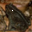 |
| 31 | dog | 1 | `python demo.py --index 31 --pixels 1 --popsize 400 --max\_iter 500` | ✅ **success** |  →  |
| 32 | deer | 1 | `python demo.py --index 32 --pixels 1 --popsize 400 --max\_iter 500` | ✅ **success** | 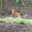 → 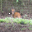 |
| 33 | cat | 1 | `python demo.py --index 33 --pixels 1 --popsize 400 --max\_iter 500` | ✅ **success** | 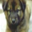 → 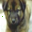 |
| 34 | truck | 3 | `python demo.py --index 34 --pixels 3 --popsize 400 --max\_iter 500` | ✅ **success** | 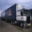 → 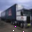 |
| 35 | truck | 1 | `python demo.py --index 35 --pixels 1 --popsize 400 --max\_iter 500` | ✅ **success** | 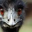 → 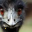 |
| 36 | horse | 1 | `python demo.py --index 36 --pixels 1 --popsize 400 --max\_iter 500` | ✅ **success** | 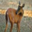 → 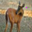 |
| 37 | automobile | 1 | `python demo.py --index 37 --pixels 1 --popsize 400 --max\_iter 500` | ✅ **success** |  → 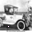 |
| 38 | truck | — | `python demo.py --index 38 --pixels 20 --popsize 400 --max\_iter 500` | ❌ fail | 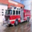 →  |
| 39 | dog | 3 | `python demo.py --index 39 --pixels 3 --popsize 400 --max\_iter 500` | ✅ **success** |  →  |
| 40 | deer | 3 | `python demo.py --index 40 --pixels 3 --popsize 400 --max\_iter 500` | ✅ **success** |  →  |
| 41 | frog | 3 | `python demo.py --index 41 --pixels 3 --popsize 400 --max\_iter 500` | ✅ **success** |  →  |
| 42 | horse | 1 | `python demo.py --index 42 --pixels 1 --popsize 400 --max\_iter 500` | ✅ **success** |  →  |
| 43 | frog | 1 | `python demo.py --index 43 --pixels 1 --popsize 400 --max\_iter 500` | ✅ **success** | 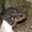 → 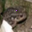 |
| 44 | airplane | 1 | `python demo.py --index 44 --pixels 1 --popsize 400 --max\_iter 500` | ✅ **success** | 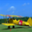 → 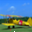 |
| 45 | truck | 3 | `python demo.py --index 45 --pixels 3 --popsize 400 --max\_iter 500` | ✅ **success** | 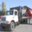 → 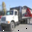 |
| 46 | dog | 1 | `python demo.py --index 46 --pixels 1 --popsize 400 --max\_iter 500` | ✅ **success** | 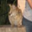 → 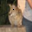 |
| 47 | horse | 1 | `python demo.py --index 47 --pixels 1 --popsize 400 --max\_iter 500` | ✅ **success** |  →  |
| 48 | horse | 3 | `python demo.py --index 48 --pixels 3 --popsize 400 --max\_iter 500` | ✅ **success** | 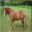 →  |
| 49 | deer | 1 | `python demo.py --index 49 --pixels 1 --popsize 400 --max\_iter 500` | ✅ **success** | 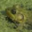 → 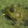 |
| 50 | truck | 1 | `python demo.py --index 50 --pixels 1 --popsize 400 --max\_iter 500` | ✅ **success** |  →  |
| 51 | ship | 1 | `python demo.py --index 51 --pixels 1 --popsize 400 --max\_iter 500` | ✅ **success** |  →  |
| 52 | dog | 1 | `python demo.py --index 52 --pixels 1 --popsize 400 --max\_iter 500` | ✅ **success** |  →  |
| 53 | cat | 1 | `python demo.py --index 53 --pixels 1 --popsize 400 --max\_iter 500` | ✅ **success** |  →  |
| 54 | ship | 1 | `python demo.py --index 54 --pixels 1 --popsize 400 --max\_iter 500` | ✅ **success** |  →  |
| 55 | ship | 3 | `python demo.py --index 55 --pixels 3 --popsize 400 --max\_iter 500` | ✅ **success** |  →  |
| 56 | horse | 3 | `python demo.py --index 56 --pixels 3 --popsize 400 --max\_iter 500` | ✅ **success** |  →  |
| 57 | ship | 1 | `python demo.py --index 57 --pixels 1 --popsize 400 --max\_iter 500` | ✅ **success** |  →  |
| 58 | cat | 1 | `python demo.py --index 58 --pixels 1 --popsize 400 --max\_iter 500` | ✅ **success** |  →  |
| 59 | bird | 1 | `python demo.py --index 59 --pixels 1 --popsize 400 --max\_iter 500` | ✅ **success** |  →  |
| 60 | horse | — | `python demo.py --index 60 --pixels 20 --popsize 400 --max\_iter 500` | ❌ fail |  →  |
| 61 | cat | 1 | `python demo.py --index 61 --pixels 1 --popsize 400 --max\_iter 500` | ✅ **success** |  →  |
| 62 | frog | 1 | `python demo.py --index 62 --pixels 1 --popsize 400 --max\_iter 500` | ✅ **success** |  →  |
| 63 | cat | 1 | `python demo.py --index 63 --pixels 1 --popsize 400 --max\_iter 500` | ✅ **success** |  →  |
| 64 | frog | 1 | `python demo.py --index 64 --pixels 1 --popsize 400 --max\_iter 500` | ✅ **success** |  →  |
| 65 | bird | 3 | `python demo.py --index 65 --pixels 3 --popsize 400 --max\_iter 500` | ✅ **success** |  →  |
| 66 | automobile | 3 | `python demo.py --index 66 --pixels 3 --popsize 400 --max\_iter 500` | ✅ **success** |  →  |
| 67 | bird | 1 | `python demo.py --index 67 --pixels 1 --popsize 400 --max\_iter 500` | ✅ **success** |  →  |
| 68 | dog | 1 | `python demo.py --index 68 --pixels 1 --popsize 400 --max\_iter 500` | ✅ **success** |  →  |
| 69 | automobile | 1 | `python demo.py --index 69 --pixels 1 --popsize 400 --max\_iter 500` | ✅ **success** |  →  |
| 70 | cat | 1 | `python demo.py --index 70 --pixels 1 --popsize 400 --max\_iter 500` | ✅ **success** |  →  |
| 71 | frog | 3 | `python demo.py --index 71 --pixels 3 --popsize 400 --max\_iter 500` | ✅ **success** |  →  |
| 72 | ship | 3 | `python demo.py --index 72 --pixels 3 --popsize 400 --max\_iter 500` | ✅ **success** |  →  |
| 73 | ship | 3 | `python demo.py --index 73 --pixels 3 --popsize 400 --max\_iter 500` | ✅ **success** |  →  |
| 74 | airplane | 1 | `python demo.py --index 74 --pixels 1 --popsize 400 --max\_iter 500` | ✅ **success** |  →  |
| 75 | bird | 3 | `python demo.py --index 75 --pixels 3 --popsize 400 --max\_iter 500` | ✅ **success** |  →  |
| 76 | airplane | 1 | `python demo.py --index 76 --pixels 1 --popsize 400 --max\_iter 500` | ✅ **success** |  →  |
| 77 | cat | 1 | `python demo.py --index 77 --pixels 1 --popsize 400 --max\_iter 500` | ✅ **success** |  →  |
| 78 | cat | 1 | `python demo.py --index 78 --pixels 1 --popsize 400 --max\_iter 500` | ✅ **success** |  →  |
| 79 | ship | 1 | `python demo.py --index 79 --pixels 1 --popsize 400 --max\_iter 500` | ✅ **success** |  →  |
| 80 | ship | 3 | `python demo.py --index 80 --pixels 3 --popsize 400 --max\_iter 500` | ✅ **success** |  →  |
| 81 | automobile | 1 | `python demo.py --index 81 --pixels 1 --popsize 400 --max\_iter 500` | ✅ **success** |  →  |
| 82 | automobile | — | `python demo.py --index 82 --pixels 20 --popsize 400 --max\_iter 500` | ❌ fail |  →  |
| 83 | horse | 1 | `python demo.py --index 83 --pixels 1 --popsize 400 --max\_iter 500` | ✅ **success** |  →  |
| 84 | bird | 1 | `python demo.py --index 84 --pixels 1 --popsize 400 --max\_iter 500` | ✅ **success** |  →  |
| 85 | horse | 1 | `python demo.py --index 85 --pixels 1 --popsize 400 --max\_iter 500` | ✅ **success** |  →  |
| 86 | horse | 1 | `python demo.py --index 86 --pixels 1 --popsize 400 --max\_iter 500` | ✅ **success** |  →  |
| 87 | truck | 1 | `python demo.py --index 87 --pixels 1 --popsize 400 --max\_iter 500` | ✅ **success** |  →  |
| 88 | ship | 5 | `python demo.py --index 88 --pixels 5 --popsize 400 --max\_iter 500` | ✅ **success** |  →  |
| 89 | truck | 5 | `python demo.py --index 89 --pixels 5 --popsize 400 --max\_iter 500` | ✅ **success** |  →  |
| 90 | airplane | 20 | `python demo.py --index 90 --pixels 20 --popsize 400 --max\_iter 500` | ✅ **success** |  →  |
| 91 | frog | 1 | `python demo.py --index 91 --pixels 1 --popsize 400 --max\_iter 500` | ✅ **success** |  →  |
