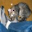
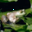
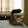
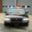
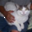

# One-/Few-Pixel Attack – Batch Results

*Generated: 2025-05-03 17:04:03*

| idx | orig → pred | variant (pixels) | cmd | result | image |
|----:|-------------|------------------|-----|--------|-------|
| 0 | dog | 1 | `python demo.py --index 0 --pixels 1 --popsize 400 --max\_iter 500` | ✅ **success** |  →  |
| 1 | ship | 1 | `python demo.py --index 1 --pixels 1 --popsize 400 --max\_iter 500` | ✅ **success** |  →  |
| 2 | airplane | 1 | `python demo.py --index 2 --pixels 1 --popsize 400 --max\_iter 500` | ✅ **success** |  →  |
| 3 | ship | 1 | `python demo.py --index 3 --pixels 1 --popsize 400 --max\_iter 500` | ✅ **success** |  →  |
| 4 | frog | 1 | `python demo.py --index 4 --pixels 1 --popsize 400 --max\_iter 500` | ✅ **success** |  →  |
| 5 | frog | — | `python demo.py --index 5 --pixels 20 --popsize 400 --max\_iter 500` | ❌ fail |  →  |
| 6 | automobile | 1 | `python demo.py --index 6 --pixels 1 --popsize 400 --max\_iter 500` | ✅ **success** |  →  |
| 7 | frog | 1 | `python demo.py --index 7 --pixels 1 --popsize 400 --max\_iter 500` | ✅ **success** |  →  |
| 8 | cat | 3 | `python demo.py --index 8 --pixels 3 --popsize 400 --max\_iter 500` | ✅ **success** |  →  |
| 9 | automobile | 3 | `python demo.py --index 9 --pixels 3 --popsize 400 --max\_iter 500` | ✅ **success** |  →  |
| 10 | airplane | 7 | `python demo.py --index 10 --pixels 7 --popsize 400 --max\_iter 500` | ✅ **success** |  →  |
| 11 | truck | — | `python demo.py --index 11 --pixels 20 --popsize 400 --max\_iter 500` | ❌ fail |  →  |
| 12 | dog | 3 | `python demo.py --index 12 --pixels 3 --popsize 400 --max\_iter 500` | ✅ **success** |  →  |
| 13 | horse | — | `python demo.py --index 13 --pixels 20 --popsize 400 --max\_iter 500` | ❌ fail |  →  |
| 14 | truck | 3 | `python demo.py --index 14 --pixels 3 --popsize 400 --max\_iter 500` | ✅ **success** |  →  |
| 15 | ship | 3 | `python demo.py --index 15 --pixels 3 --popsize 400 --max\_iter 500` | ✅ **success** |  →  |
| 16 | dog | 3 | `python demo.py --index 16 --pixels 3 --popsize 400 --max\_iter 500` | ✅ **success** |  →  |
| 17 | horse | 1 | `python demo.py --index 17 --pixels 1 --popsize 400 --max\_iter 500` | ✅ **success** |  →  |
| 18 | ship | 3 | `python demo.py --index 18 --pixels 3 --popsize 400 --max\_iter 500` | ✅ **success** |  →  |
| 19 | frog | 3 | `python demo.py --index 19 --pixels 3 --popsize 400 --max\_iter 500` | ✅ **success** |  →  |
| 20 | horse | 3 | `python demo.py --index 20 --pixels 3 --popsize 400 --max\_iter 500` | ✅ **success** |  →  |
| 21 | airplane | 1 | `python demo.py --index 21 --pixels 1 --popsize 400 --max\_iter 500` | ✅ **success** |  →  |
| 22 | deer | 1 | `python demo.py --index 22 --pixels 1 --popsize 400 --max\_iter 500` | ✅ **success** |  →  |
| 23 | truck | — | `python demo.py --index 23 --pixels 20 --popsize 400 --max\_iter 500` | ❌ fail |  →  |
| 24 | dog | 1 | `python demo.py --index 24 --pixels 1 --popsize 400 --max\_iter 500` | ✅ **success** |  →  |
| 25 | dog | 1 | `python demo.py --index 25 --pixels 1 --popsize 400 --max\_iter 500` | ✅ **success** |  →  |
| 26 | deer | 1 | `python demo.py --index 26 --pixels 1 --popsize 400 --max\_iter 500` | ✅ **success** |  →  |
| 27 | airplane | 3 | `python demo.py --index 27 --pixels 3 --popsize 400 --max\_iter 500` | ✅ **success** |  →  |
| 28 | truck | 1 | `python demo.py --index 28 --pixels 1 --popsize 400 --max\_iter 500` | ✅ **success** |  →  |
| 29 | frog | — | `python demo.py --index 29 --pixels 20 --popsize 400 --max\_iter 500` | ❌ fail |  →  |
| 30 | frog | 1 | `python demo.py --index 30 --pixels 1 --popsize 400 --max\_iter 500` | ✅ **success** |  →  |
| 31 | dog | 1 | `python demo.py --index 31 --pixels 1 --popsize 400 --max\_iter 500` | ✅ **success** |  →  |
| 32 | deer | 1 | `python demo.py --index 32 --pixels 1 --popsize 400 --max\_iter 500` | ✅ **success** |  →  |
| 33 | cat | 1 | `python demo.py --index 33 --pixels 1 --popsize 400 --max\_iter 500` | ✅ **success** |  →  |
| 34 | truck | 3 | `python demo.py --index 34 --pixels 3 --popsize 400 --max\_iter 500` | ✅ **success** |  →  |
| 35 | truck | 1 | `python demo.py --index 35 --pixels 1 --popsize 400 --max\_iter 500` | ✅ **success** |  →  |
| 36 | horse | 1 | `python demo.py --index 36 --pixels 1 --popsize 400 --max\_iter 500` | ✅ **success** |  →  |
| 37 | automobile | 1 | `python demo.py --index 37 --pixels 1 --popsize 400 --max\_iter 500` | ✅ **success** |  →  |
| 38 | truck | — | `python demo.py --index 38 --pixels 20 --popsize 400 --max\_iter 500` | ❌ fail |  →  |
| 39 | dog | 3 | `python demo.py --index 39 --pixels 3 --popsize 400 --max\_iter 500` | ✅ **success** |  →  |
| 40 | deer | 3 | `python demo.py --index 40 --pixels 3 --popsize 400 --max\_iter 500` | ✅ **success** |  →  |
| 41 | frog | 3 | `python demo.py --index 41 --pixels 3 --popsize 400 --max\_iter 500` | ✅ **success** |  →  |
| 42 | horse | 1 | `python demo.py --index 42 --pixels 1 --popsize 400 --max\_iter 500` | ✅ **success** |  →  |
| 43 | frog | 1 | `python demo.py --index 43 --pixels 1 --popsize 400 --max\_iter 500` | ✅ **success** |  →  |
| 44 | airplane | 1 | `python demo.py --index 44 --pixels 1 --popsize 400 --max\_iter 500` | ✅ **success** |  →  |
| 45 | truck | 3 | `python demo.py --index 45 --pixels 3 --popsize 400 --max\_iter 500` | ✅ **success** |  →  |
| 46 | dog | 1 | `python demo.py --index 46 --pixels 1 --popsize 400 --max\_iter 500` | ✅ **success** |  →  |
| 47 | horse | 1 | `python demo.py --index 47 --pixels 1 --popsize 400 --max\_iter 500` | ✅ **success** |  →  |
| 48 | horse | 3 | `python demo.py --index 48 --pixels 3 --popsize 400 --max\_iter 500` | ✅ **success** |  →  |
| 49 | deer | 1 | `python demo.py --index 49 --pixels 1 --popsize 400 --max\_iter 500` | ✅ **success** |  →  |
| 50 | truck | 1 | `python demo.py --index 50 --pixels 1 --popsize 400 --max\_iter 500` | ✅ **success** |  →  |
| 51 | ship | 1 | `python demo.py --index 51 --pixels 1 --popsize 400 --max\_iter 500` | ✅ **success** |  →  |
| 52 | dog | 1 | `python demo.py --index 52 --pixels 1 --popsize 400 --max\_iter 500` | ✅ **success** |  →  |
| 53 | cat | 1 | `python demo.py --index 53 --pixels 1 --popsize 400 --max\_iter 500` | ✅ **success** |  →  |
| 54 | ship | 1 | `python demo.py --index 54 --pixels 1 --popsize 400 --max\_iter 500` | ✅ **success** |  →  |
| 55 | ship | 3 | `python demo.py --index 55 --pixels 3 --popsize 400 --max\_iter 500` | ✅ **success** |  →  |
| 56 | horse | 3 | `python demo.py --index 56 --pixels 3 --popsize 400 --max\_iter 500` | ✅ **success** |  →  |
| 57 | ship | 1 | `python demo.py --index 57 --pixels 1 --popsize 400 --max\_iter 500` | ✅ **success** |  →  |
| 58 | cat | 1 | `python demo.py --index 58 --pixels 1 --popsize 400 --max\_iter 500` | ✅ **success** |  →  |
| 59 | bird | 1 | `python demo.py --index 59 --pixels 1 --popsize 400 --max\_iter 500` | ✅ **success** |  →  |
| 60 | horse | — | `python demo.py --index 60 --pixels 20 --popsize 400 --max\_iter 500` | ❌ fail |  →  |
| 61 | cat | 1 | `python demo.py --index 61 --pixels 1 --popsize 400 --max\_iter 500` | ✅ **success** |  →  |
| 62 | frog | 1 | `python demo.py --index 62 --pixels 1 --popsize 400 --max\_iter 500` | ✅ **success** |  →  |
| 63 | cat | 1 | `python demo.py --index 63 --pixels 1 --popsize 400 --max\_iter 500` | ✅ **success** |  →  |
| 64 | frog | 1 | `python demo.py --index 64 --pixels 1 --popsize 400 --max\_iter 500` | ✅ **success** |  →  |
| 65 | bird | 3 | `python demo.py --index 65 --pixels 3 --popsize 400 --max\_iter 500` | ✅ **success** |  →  |
| 66 | automobile | 3 | `python demo.py --index 66 --pixels 3 --popsize 400 --max\_iter 500` | ✅ **success** |  →  |
| 67 | bird | 1 | `python demo.py --index 67 --pixels 1 --popsize 400 --max\_iter 500` | ✅ **success** |  →  |
| 68 | dog | 1 | `python demo.py --index 68 --pixels 1 --popsize 400 --max\_iter 500` | ✅ **success** |  →  |
| 69 | automobile | 1 | `python demo.py --index 69 --pixels 1 --popsize 400 --max\_iter 500` | ✅ **success** |  →  |
| 70 | cat | 1 | `python demo.py --index 70 --pixels 1 --popsize 400 --max\_iter 500` | ✅ **success** |  →  |
| 71 | frog | 3 | `python demo.py --index 71 --pixels 3 --popsize 400 --max\_iter 500` | ✅ **success** |  →  |
| 72 | ship | 3 | `python demo.py --index 72 --pixels 3 --popsize 400 --max\_iter 500` | ✅ **success** |  →  |
| 73 | ship | 3 | `python demo.py --index 73 --pixels 3 --popsize 400 --max\_iter 500` | ✅ **success** |  →  |
| 74 | airplane | 1 | `python demo.py --index 74 --pixels 1 --popsize 400 --max\_iter 500` | ✅ **success** |  →  |
| 75 | bird | 3 | `python demo.py --index 75 --pixels 3 --popsize 400 --max\_iter 500` | ✅ **success** |  →  |
| 76 | airplane | 1 | `python demo.py --index 76 --pixels 1 --popsize 400 --max\_iter 500` | ✅ **success** |  →  |
| 77 | cat | 1 | `python demo.py --index 77 --pixels 1 --popsize 400 --max\_iter 500` | ✅ **success** |  →  |
| 78 | cat | 1 | `python demo.py --index 78 --pixels 1 --popsize 400 --max\_iter 500` | ✅ **success** |  →  |
| 79 | ship | 1 | `python demo.py --index 79 --pixels 1 --popsize 400 --max\_iter 500` | ✅ **success** |  →  |
| 80 | ship | 3 | `python demo.py --index 80 --pixels 3 --popsize 400 --max\_iter 500` | ✅ **success** |  →  |
| 81 | automobile | 1 | `python demo.py --index 81 --pixels 1 --popsize 400 --max\_iter 500` | ✅ **success** |  →  |
| 82 | automobile | — | `python demo.py --index 82 --pixels 20 --popsize 400 --max\_iter 500` | ❌ fail |  →  |
| 83 | horse | 1 | `python demo.py --index 83 --pixels 1 --popsize 400 --max\_iter 500` | ✅ **success** |  →  |
| 84 | bird | 1 | `python demo.py --index 84 --pixels 1 --popsize 400 --max\_iter 500` | ✅ **success** |  →  |
| 85 | horse | 1 | `python demo.py --index 85 --pixels 1 --popsize 400 --max\_iter 500` | ✅ **success** |  →  |
| 86 | horse | 1 | `python demo.py --index 86 --pixels 1 --popsize 400 --max\_iter 500` | ✅ **success** |  →  |
| 87 | truck | 1 | `python demo.py --index 87 --pixels 1 --popsize 400 --max\_iter 500` | ✅ **success** |  →  |
| 88 | ship | 5 | `python demo.py --index 88 --pixels 5 --popsize 400 --max\_iter 500` | ✅ **success** |  →  |
| 89 | truck | 5 | `python demo.py --index 89 --pixels 5 --popsize 400 --max\_iter 500` | ✅ **success** |  →  |
| 90 | airplane | 20 | `python demo.py --index 90 --pixels 20 --popsize 400 --max\_iter 500` | ✅ **success** |  →  |
| 91 | frog | 1 | `python demo.py --index 91 --pixels 1 --popsize 400 --max\_iter 500` | ✅ **success** |  →  |
| 92 | ship | — | `python demo.py --index 92 --pixels 20 --popsize 400 --max\_iter 500` | ❌ fail |  →  |
| 93 | frog | — | `python demo.py --index 93 --pixels 20 --popsize 400 --max\_iter 500` | ❌ fail |  →  |
| 94 | deer | 1 | `python demo.py --index 94 --pixels 1 --popsize 400 --max\_iter 500` | ✅ **success** |  →  |
| 95 | frog | 5 | `python demo.py --index 95 --pixels 5 --popsize 400 --max\_iter 500` | ✅ **success** |  →  |
| 96 | frog | 3 | `python demo.py --index 96 --pixels 3 --popsize 400 --max\_iter 500` | ✅ **success** |  →  |
| 97 | airplane | 1 | `python demo.py --index 97 --pixels 1 --popsize 400 --max\_iter 500` | ✅ **success** |  →  |
| 98 | airplane | — | `python demo.py --index 98 --pixels 20 --popsize 400 --max\_iter 500` | ❌ fail |  →  |
| 99 | cat | 1 | `python demo.py --index 99 --pixels 1 --popsize 400 --max\_iter 500` | ✅ **success** |  →  |
| 100 | deer | 1 | `python demo.py --index 100 --pixels 1 --popsize 400 --max\_iter 500` | ✅ **success** |  →  |
| 101 | dog | 1 | `python demo.py --index 101 --pixels 1 --popsize 400 --max\_iter 500` | ✅ **success** |  →  |
| 102 | frog | 3 | `python demo.py --index 102 --pixels 3 --popsize 400 --max\_iter 500` | ✅ **success** |  →  |
| 103 | cat | 3 | `python demo.py --index 103 --pixels 3 --popsize 400 --max\_iter 500` | ✅ **success** |  →  |
| 104 | automobile | 18 | `python demo.py --index 104 --pixels 18 --popsize 400 --max\_iter 500` | ✅ **success** |  →  |
| 105 | automobile | 3 | `python demo.py --index 105 --pixels 3 --popsize 400 --max\_iter 500` | ✅ **success** |  →  |
| 106 | dog | 1 | `python demo.py --index 106 --pixels 1 --popsize 400 --max\_iter 500` | ✅ **success** |  →  |
| 107 | frog | — | `python demo.py --index 107 --pixels 20 --popsize 400 --max\_iter 500` | ❌ fail |  →  |
| 108 | ship | 1 | `python demo.py --index 108 --pixels 1 --popsize 400 --max\_iter 500` | ✅ **success** |  →  |
| 109 | dog | 1 | `python demo.py --index 109 --pixels 1 --popsize 400 --max\_iter 500` | ✅ **success** |  →  |
| 110 | deer | 1 | `python demo.py --index 110 --pixels 1 --popsize 400 --max\_iter 500` | ✅ **success** |  →  |
| 111 | airplane | — | `python demo.py --index 111 --pixels 20 --popsize 400 --max\_iter 500` | ❌ fail |  →  |
| 112 | frog | 3 | `python demo.py --index 112 --pixels 3 --popsize 400 --max\_iter 500` | ✅ **success** |  →  |
| 113 | cat | 1 | `python demo.py --index 113 --pixels 1 --popsize 400 --max\_iter 500` | ✅ **success** |  →  |
| 114 | automobile | 1 | `python demo.py --index 114 --pixels 1 --popsize 400 --max\_iter 500` | ✅ **success** |  →  |
| 115 | airplane | 1 | `python demo.py --index 115 --pixels 1 --popsize 400 --max\_iter 500` | ✅ **success** |  →  |
| 116 | airplane | 1 | `python demo.py --index 116 --pixels 1 --popsize 400 --max\_iter 500` | ✅ **success** |  →  |
| 117 | deer | 3 | `python demo.py --index 117 --pixels 3 --popsize 400 --max\_iter 500` | ✅ **success** |  →  |
| 118 | cat | 1 | `python demo.py --index 118 --pixels 1 --popsize 400 --max\_iter 500` | ✅ **success** |  →  |
| 119 | dog | 1 | `python demo.py --index 119 --pixels 1 --popsize 400 --max\_iter 500` | ✅ **success** |  →  |
| 120 | ship | 1 | `python demo.py --index 120 --pixels 1 --popsize 400 --max\_iter 500` | ✅ **success** |  →  |
| 121 | horse | 1 | `python demo.py --index 121 --pixels 1 --popsize 400 --max\_iter 500` | ✅ **success** |  →  |
| 122 | automobile | 1 | `python demo.py --index 122 --pixels 1 --popsize 400 --max\_iter 500` | ✅ **success** |  →  |
| 123 | bird | 3 | `python demo.py --index 123 --pixels 3 --popsize 400 --max\_iter 500` | ✅ **success** |  →  |
| 124 | ship | 3 | `python demo.py --index 124 --pixels 3 --popsize 400 --max\_iter 500` | ✅ **success** |  →  |
| 125 | airplane | 1 | `python demo.py --index 125 --pixels 1 --popsize 400 --max\_iter 500` | ✅ **success** |  →  |
| 126 | ship | 3 | `python demo.py --index 126 --pixels 3 --popsize 400 --max\_iter 500` | ✅ **success** |  →  |
| 127 | cat | 1 | `python demo.py --index 127 --pixels 1 --popsize 400 --max\_iter 500` | ✅ **success** |  →  |
| 128 | dog | 1 | `python demo.py --index 128 --pixels 1 --popsize 400 --max\_iter 500` | ✅ **success** |  →  |
| 129 | airplane | 1 | `python demo.py --index 129 --pixels 1 --popsize 400 --max\_iter 500` | ✅ **success** |  →  |
| 130 | deer | 3 | `python demo.py --index 130 --pixels 3 --popsize 400 --max\_iter 500` | ✅ **success** |  →  |
| 131 | automobile | 3 | `python demo.py --index 131 --pixels 3 --popsize 400 --max\_iter 500` | ✅ **success** |  →  |
| 132 | truck | 1 | `python demo.py --index 132 --pixels 1 --popsize 400 --max\_iter 500` | ✅ **success** |  →  |
| 133 | truck | — | `python demo.py --index 133 --pixels 20 --popsize 400 --max\_iter 500` | ❌ fail |  →  |
| 134 | automobile | 3 | `python demo.py --index 134 --pixels 3 --popsize 400 --max\_iter 500` | ✅ **success** |  →  |
| 135 | bird | 1 | `python demo.py --index 135 --pixels 1 --popsize 400 --max\_iter 500` | ✅ **success** |  →  |
| 136 | truck | 3 | `python demo.py --index 136 --pixels 3 --popsize 400 --max\_iter 500` | ✅ **success** |  →  |
| 137 | horse | — | `python demo.py --index 137 --pixels 20 --popsize 400 --max\_iter 500` | ❌ fail |  →  |
| 138 | bird | 1 | `python demo.py --index 138 --pixels 1 --popsize 400 --max\_iter 500` | ✅ **success** |  →  |
| 139 | ship | 1 | `python demo.py --index 139 --pixels 1 --popsize 400 --max\_iter 500` | ✅ **success** |  →  |
| 140 | cat | 1 | `python demo.py --index 140 --pixels 1 --popsize 400 --max\_iter 500` | ✅ **success** |  →  |
| 141 | dog | — | `python demo.py --index 141 --pixels 20 --popsize 400 --max\_iter 500` | ❌ fail |  →  |
| 142 | frog | 1 | `python demo.py --index 142 --pixels 1 --popsize 400 --max\_iter 500` | ✅ **success** |  →  |
| 143 | cat | 1 | `python demo.py --index 143 --pixels 1 --popsize 400 --max\_iter 500` | ✅ **success** |  →  |
| 144 | ship | 3 | `python demo.py --index 144 --pixels 3 --popsize 400 --max\_iter 500` | ✅ **success** |  →  |
| 145 | horse | 3 | `python demo.py --index 145 --pixels 3 --popsize 400 --max\_iter 500` | ✅ **success** |  →  |
| 146 | frog | 1 | `python demo.py --index 146 --pixels 1 --popsize 400 --max\_iter 500` | ✅ **success** |  →  |
| 147 | frog | 1 | `python demo.py --index 147 --pixels 1 --popsize 400 --max\_iter 500` | ✅ **success** |  →  |
| 148 | bird | 1 | `python demo.py --index 148 --pixels 1 --popsize 400 --max\_iter 500` | ✅ **success** |  →  |
| 149 | bird | 1 | `python demo.py --index 149 --pixels 1 --popsize 400 --max\_iter 500` | ✅ **success** |  →  |
| 150 | ship | 1 | `python demo.py --index 150 --pixels 1 --popsize 400 --max\_iter 500` | ✅ **success** |  →  |
| 151 | truck | 3 | `python demo.py --index 151 --pixels 3 --popsize 400 --max\_iter 500` | ✅ **success** |  →  |
| 152 | frog | 3 | `python demo.py --index 152 --pixels 3 --popsize 400 --max\_iter 500` | ✅ **success** |  →  |
| 153 | airplane | 3 | `python demo.py --index 153 --pixels 3 --popsize 400 --max\_iter 500` | ✅ **success** |  →  |
| 154 | airplane | 1 | `python demo.py --index 154 --pixels 1 --popsize 400 --max\_iter 500` | ✅ **success** |  →  |
| 155 | dog | 1 | `python demo.py --index 155 --pixels 1 --popsize 400 --max\_iter 500` | ✅ **success** |  →  |
| 156 | bird | 1 | `python demo.py --index 156 --pixels 1 --popsize 400 --max\_iter 500` | ✅ **success** |  →  |
| 157 | truck | 3 | `python demo.py --index 157 --pixels 3 --popsize 400 --max\_iter 500` | ✅ **success** |  →  |
| 158 | cat | 1 | `python demo.py --index 158 --pixels 1 --popsize 400 --max\_iter 500` | ✅ **success** |  →  |
| 159 | deer | 5 | `python demo.py --index 159 --pixels 5 --popsize 400 --max\_iter 500` | ✅ **success** |  →  |
| 160 | airplane | 1 | `python demo.py --index 160 --pixels 1 --popsize 400 --max\_iter 500` | ✅ **success** |  →  |
| 161 | automobile | 18 | `python demo.py --index 161 --pixels 18 --popsize 400 --max\_iter 500` | ✅ **success** |  →  |
| 162 | bird | 1 | `python demo.py --index 162 --pixels 1 --popsize 400 --max\_iter 500` | ✅ **success** |  →  |
| 163 | frog | 3 | `python demo.py --index 163 --pixels 3 --popsize 400 --max\_iter 500` | ✅ **success** |  →  |
| 164 | ship | 1 | `python demo.py --index 164 --pixels 1 --popsize 400 --max\_iter 500` | ✅ **success** |  →  |
| 165 | deer | 1 | `python demo.py --index 165 --pixels 1 --popsize 400 --max\_iter 500` | ✅ **success** |  →  |
| 166 | ship | 3 | `python demo.py --index 166 --pixels 3 --popsize 400 --max\_iter 500` | ✅ **success** |  →  |
| 167 | deer | 1 | `python demo.py --index 167 --pixels 1 --popsize 400 --max\_iter 500` | ✅ **success** |  →  |
| 168 | frog | 1 | `python demo.py --index 168 --pixels 1 --popsize 400 --max\_iter 500` | ✅ **success** |  →  |
| 169 | airplane | 1 | `python demo.py --index 169 --pixels 1 --popsize 400 --max\_iter 500` | ✅ **success** |  →  |
| 170 | truck | 1 | `python demo.py --index 170 --pixels 1 --popsize 400 --max\_iter 500` | ✅ **success** |  →  |
| 171 | airplane | 1 | `python demo.py --index 171 --pixels 1 --popsize 400 --max\_iter 500` | ✅ **success** |  →  |
| 172 | automobile | 1 | `python demo.py --index 172 --pixels 1 --popsize 400 --max\_iter 500` | ✅ **success** |  →  |
| 173 | ship | 3 | `python demo.py --index 173 --pixels 3 --popsize 400 --max\_iter 500` | ✅ **success** |  →  |
| 174 | truck | 3 | `python demo.py --index 174 --pixels 3 --popsize 400 --max\_iter 500` | ✅ **success** |  →  |
| 175 | truck | — | `python demo.py --index 175 --pixels 20 --popsize 400 --max\_iter 500` | ❌ fail |  →  |
| 176 | cat | 3 | `python demo.py --index 176 --pixels 3 --popsize 400 --max\_iter 500` | ✅ **success** |  →  |
| 177 | horse | 3 | `python demo.py --index 177 --pixels 3 --popsize 400 --max\_iter 500` | ✅ **success** |  →  |
| 178 | cat | 1 | `python demo.py --index 178 --pixels 1 --popsize 400 --max\_iter 500` | ✅ **success** |  →  |
| 179 | airplane | 1 | `python demo.py --index 179 --pixels 1 --popsize 400 --max\_iter 500` | ✅ **success** |  →  |
| 180 | airplane | 3 | `python demo.py --index 180 --pixels 3 --popsize 400 --max\_iter 500` | ✅ **success** |  →  |
| 181 | dog | 1 | `python demo.py --index 181 --pixels 1 --popsize 400 --max\_iter 500` | ✅ **success** |  →  |
| 182 | bird | 1 | `python demo.py --index 182 --pixels 1 --popsize 400 --max\_iter 500` | ✅ **success** |  →  |
| 183 | cat | 1 | `python demo.py --index 183 --pixels 1 --popsize 400 --max\_iter 500` | ✅ **success** |  →  |
| 184 | airplane | 1 | `python demo.py --index 184 --pixels 1 --popsize 400 --max\_iter 500` | ✅ **success** |  →  |
| 185 | ship | 3 | `python demo.py --index 185 --pixels 3 --popsize 400 --max\_iter 500` | ✅ **success** |  →  |
| 186 | frog | 1 | `python demo.py --index 186 --pixels 1 --popsize 400 --max\_iter 500` | ✅ **success** |  →  |
| 187 | cat | 1 | `python demo.py --index 187 --pixels 1 --popsize 400 --max\_iter 500` | ✅ **success** |  →  |
| 188 | cat | 1 | `python demo.py --index 188 --pixels 1 --popsize 400 --max\_iter 500` | ✅ **success** |  →  |
| 189 | airplane | 1 | `python demo.py --index 189 --pixels 1 --popsize 400 --max\_iter 500` | ✅ **success** |  →  |
| 190 | horse | 1 | `python demo.py --index 190 --pixels 1 --popsize 400 --max\_iter 500` | ✅ **success** |  →  |
| 191 | ship | 1 | `python demo.py --index 191 --pixels 1 --popsize 400 --max\_iter 500` | ✅ **success** |  →  |
| 192 | airplane | 1 | `python demo.py --index 192 --pixels 1 --popsize 400 --max\_iter 500` | ✅ **success** |  →  |
| 193 | automobile | 3 | `python demo.py --index 193 --pixels 3 --popsize 400 --max\_iter 500` | ✅ **success** |  →  |
| 194 | horse | 7 | `python demo.py --index 194 --pixels 7 --popsize 400 --max\_iter 500` | ✅ **success** |  →  |
| 195 | cat | 1 | `python demo.py --index 195 --pixels 1 --popsize 400 --max\_iter 500` | ✅ **success** |  →  |
| 196 | ship | — | `python demo.py --index 196 --pixels 20 --popsize 400 --max\_iter 500` | ❌ fail |  →  |
| 197 | ship | 1 | `python demo.py --index 197 --pixels 1 --popsize 400 --max\_iter 500` | ✅ **success** |  →  |
| 198 | horse | 1 | `python demo.py --index 198 --pixels 1 --popsize 400 --max\_iter 500` | ✅ **success** |  →  |
| 199 | ship | 1 | `python demo.py --index 199 --pixels 1 --popsize 400 --max\_iter 500` | ✅ **success** |  →  |
